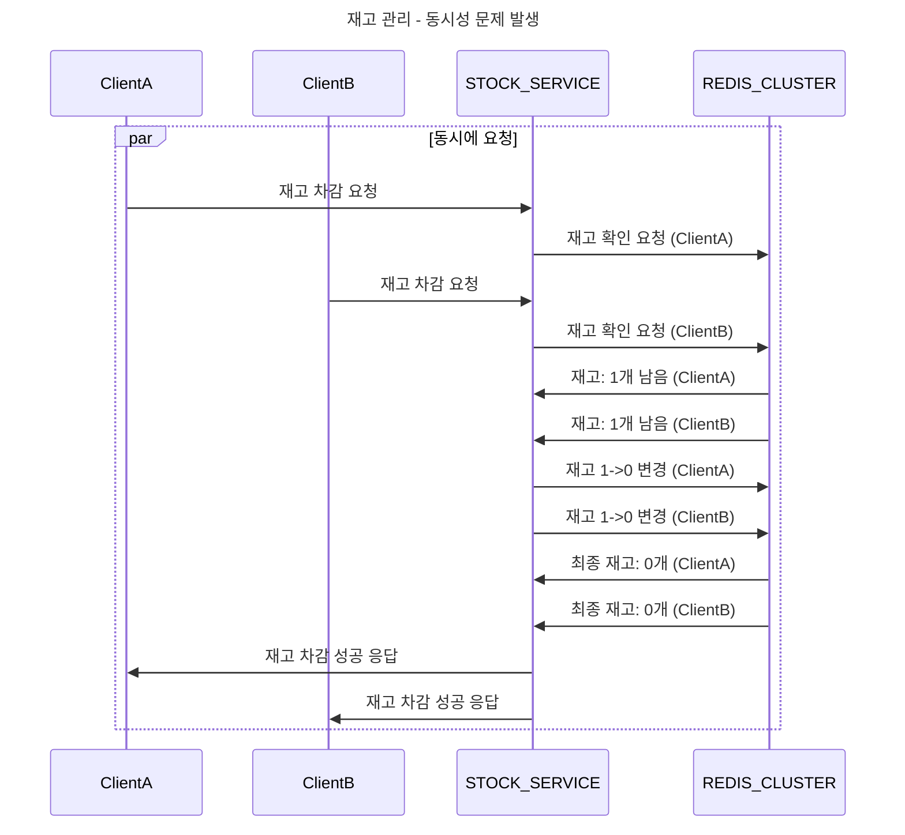
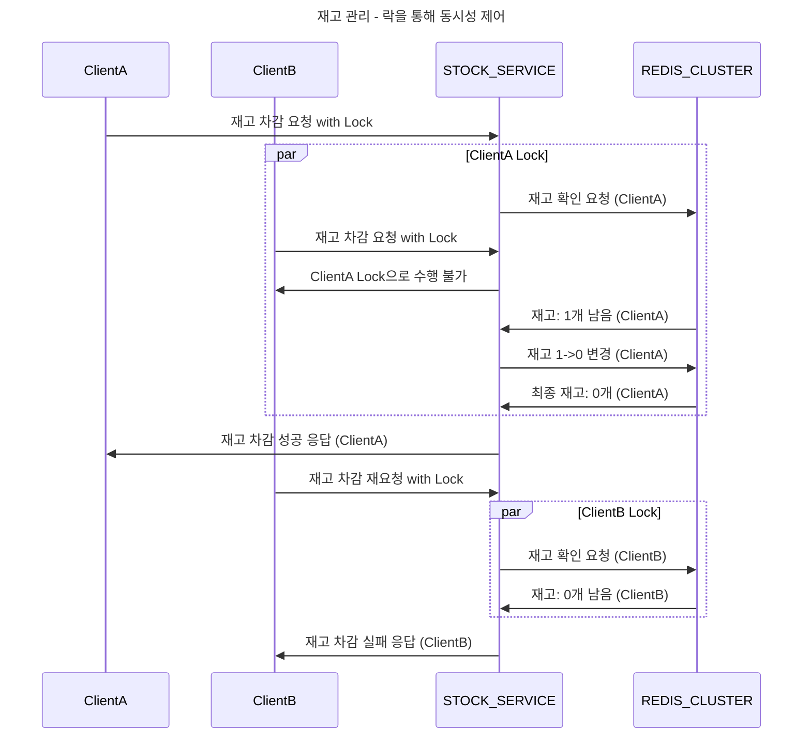
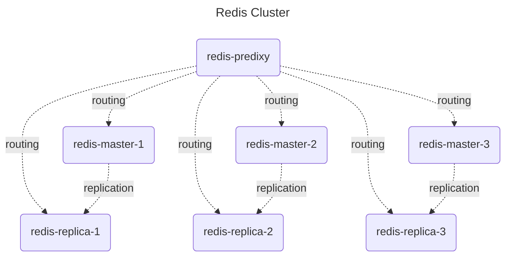

# Redisson
- Redis 기반 분산 데이터 처리 및 동기화를 도와주는 Java 기반의 Redis Client
- 여러 노드 간 동기화, 분산락 등을 구현할 수 있다.

## 동시성 제어 - 분산락
- 분산 환경에서 동기화 및 동시성 제어가 필요할 때 사용한다.
- 여러 애플리케이션 인스턴스에서 같은 자원에 동시에 접근할 때 등.
  - 특히 재고 관리 처리에 사용

## Redisson v.s. Lettuce
||수준|복잡도|Spring과 통합|분산락 가능 여부|
|:--:|:--:|:--:|:--:|:--:|
|Redisson|고수준|낮음|염두에 두고 설계되어 쉬움|가능|
|Lettuce|저수준|높음|가능하지만 비교적 복잡함|가능|

## 예시
- 재고가 1개 남아있는 상황에서 두 클라이언트가 분산락 없이 동시에 재고 차감 요청을 했다고 가정
- 재고 차감 과정은 재고 확인 -> 재고 변경 -> 성공 여부 응답으로 이루어진다고 가정
- 일어날 수 있는 상황은 
  - 재고는 0으로 수정되었지만, A, B 두 클라이언트에게 재고 차감 성공 응답이 반환됨


## 해결 방안
- 분산 락을 통해 재고 키 값을 제어할 때 락을 부여한다.
- A 클라이언트가 재고 차감 요청을 수행하는 동안, Redis Cluster의 재고 키를 사용할 수 없도록 한다.


## Hands On
- 간단한 예시코드를 작성하여 분산락 여부에 따른 테스트 케이스를 작성해본다.

### 환경구성
[Docker](./docker/)를 활용해 다음과 같은 Redis Cluster를 구성한다.  
```redis-predixy``` 프록시를 통해 클러스터와 통신할 예정이다.  

```bash
# docker-compose로 predixy, redis-cluster 실행
$ docker-compose up -d

# master-replica 연결
$ docker exec -it redis-master-1 bash /init.sh
```

### 공통
- [build.gradle.kts](./build.gradle.kts)
  - redisson 라이브러리 설정
- [application.yaml](./src/main/resources/application.yaml)
  - redis 접속 정보 설정
- [StockService](./src/main/kotlin/com/demo/redisson/service/StockService.kt)
  - 재고 관련 추상 클래스 정의 - 락을 사용하는 객체, 락을 사용하지 않는 객체 작성을 위함

### 락을 사용하지 않는 경우
- [RedisConfigForNoLock](./src/main/kotlin/com/demo/redisson/nolock/config/RedisConfigForNoLock.kt)
  - 기본으로 제공되는 Redis Client 정보 설정
- [StockServiceForNoLock](./src/main/kotlin/com/demo/redisson/nolock/service/StockServiceForNoLock.kt)
  - 락을 사용하지 않고 재고 차감을 수행하는 Service 클래스
  - redisTemplate 사용
- [StockServiceForNoLockTests](./src/test/kotlin/com/demo/redisson/nolock/service/StockServiceForNoLockTests.kt)
  - 락을 사용하지 않고 재고 차감을 수행하는 Service 테스트 클래스

### 락을 사용하는 경우
- [RedissonConfigForLock](./src/main/kotlin/com/demo/redisson/lock/config/RedissonConfigForLock.kt)
  - 기본으로 제공되는 Redis Client 정보 설정
- [StockServiceForLock](./src/main/kotlin/com/demo/redisson/lock/service/StockServiceForLock.kt)
  - 락을 사용하지 않고 재고 차감을 수행하는 Service 클래스
  - redissonClient 사용
- [StockServiceForLockTests](./src/test/kotlin/com/demo/redisson/lock/StockServiceForLockTests.kt)
  - 락을 사용하지 않고 재고 차감을 수행하는 Service 테스트 클래스
